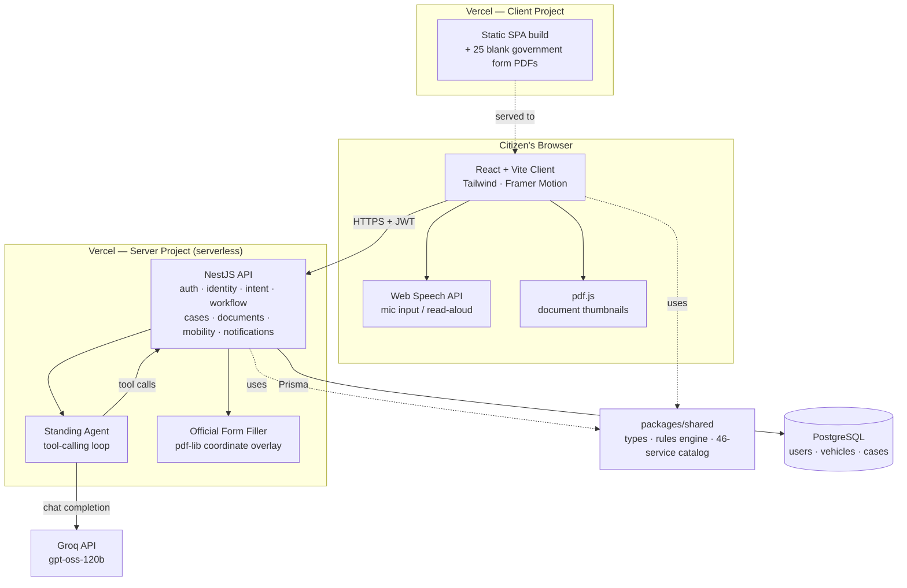

# Parivahan Track

A citizen-first layer over India's fragmented transport services — one login, one guided flow, one place to track what happens next, built around a single flagship scenario: **reporting a road accident**, a service that today does not exist anywhere in this ecosystem.

---

## 1. Problem Statement

A citizen dealing with Indian transport services today has to juggle three separately-branded, separately-logged-in government systems: **Vahan** (vehicle registration), **Sarathi** (driving licence), and the **PUC portal** (pollution certificates) — plus **eChallan** for traffic fines. None of them share a session, a profile, or a vehicle record. Every service page follows the same pattern: a static *process flow → step-by-step procedure → avail service* page to read before a usable form even opens. Once something is submitted, the system has nothing more to say than "Application under process at RTO level" — no stage timeline, no named office, no deadline.

One gap is worse than the rest: **accident reporting has no digital home anywhere in this ecosystem.** We verified this directly by searching Vahan, Sarathi, and eChallan for a citizen-facing accident-report service — none exists. It is a police-station, FIR-only process today, using an internal recording format (MoRTH's Road Accident Recording Form) that a citizen never sees or fills in themselves. In the minutes after a crash — disoriented, possibly injured, dealing with another party — a citizen has no structured way to capture what happened while it's fresh, and no digital trail of having reported it at all.

## 2. Our Solution

Parivahan Track is a single guided experience layered on top of this fragmented system, built around one login and one flagship flow: **describe what happened, in your own words or by voice, and be walked through a structured accident report one question at a time** — the same plain-language, one-question-per-screen pattern applied to grievance filing and challan disputes.

Concretely, for the accident scenario:

- A citizen tells the "Journey Guide" what happened — typed or spoken — in ordinary language ("I was in an accident"), not a portal menu label.
- The app matches this to the Accident Report flow and states its confidence, rather than silently guessing.
- The report is broken into five short screens (review what's needed → incident details → conditions → people and vehicles involved → confirm and submit), each using real government vocabulary (area type, weather, collision type, hit-and-run, injury severity) drawn from MoRTH's own accident-recording form, rendered as tap-to-select chips where possible so nothing needs to be typed from memory.
- Every text field also accepts voice input, and location can be auto-detected — built for someone who may not want to (or be able to) type at length one-handed after a crash.
- Submitting produces a tracked **Case** with a stage, a due-by date, a live countdown, and a one-tap escalation — not a form that vanishes into a black box — plus a downloadable structured PDF a citizen can hand to a police station or insurer.

The same pattern (guided, voice-capable, plain-language, always-confirmed, always-tracked) is applied to grievance filing and challan disputes, and beyond that, to every real "apply for X" service in the catalog — because the underlying problem (static instructions, opaque submission, no tracking) is the same across all of them.

**The full user flow, as walked and verified end-to-end with a real browser:**

1. **Home, logged out** — marketing content and a "Discover your route" preview, no login wall.
2. **Sign up** — full name + mobile number, no password (see [What's Real vs. Mocked](#6-whats-real-vs-mocked)); or "Quick sign in as [demo citizen]" for reviewers.
3. **One-time vehicle onboarding** — short, explicitly skippable.
4. **Dashboard** — hero CTA ("Ask the journey guide" / "Browse all services"), Mobility Health Score, My Vahan, My Documents.
5. **Journey Guide** — typed or spoken request → matched service with a stated confidence level.
6. **Guided Accident Report** — five short screens, tap-to-select chips, mic buttons, auto-location.
7. **Confirmation** — inline, immediate, no reload.
8. **Case Tracking** — colored status badge, due-by date, live countdown, one-tap escalation, download.
9. **Download** — a real, generated PDF a citizen can hand to a police station or insurer.
10. **My Documents** — every completed service reappears with a real thumbnail and a re-download, strictly scoped to the signed-in citizen.

Two other surfaces are walked the same way: the **Services** catalog (browse by category) and the **Smart Mobility Map** (overlay layers, auto-detect location, jump straight into a guided report from the map).

## 3. Tech Stack

| Layer | Stack |
|---|---|
| **Client** | React 18 + TypeScript + Vite, Tailwind CSS, Framer Motion |
| **Server** | NestJS (TypeScript), modular by domain: `auth`, `identity`, `intent`, `workflow`, `cases`, `documents`, `mobility-intelligence`, `notifications`, `phase3` (AI) |
| **Shared domain layer** | `packages/shared` — types, rules engine (SLA/case logic, mobility nudges), and the 46-service catalog, used by both client and server |
| **Data** | PostgreSQL via Prisma (users, vehicles, cases) |
| **AI reasoning** | `openai/gpt-oss-120b` — an OpenAI open-weight model, served via Groq's API for speed/stability, with an 8-tool tool-calling loop and a curated RTO/Parivahan knowledge base in the system prompt |
| **Voice** | Browser-native Web Speech API — `SpeechRecognition` for input, `speechSynthesis` for read-aloud — no external voice API, no key, no per-call cost |
| **PDF generation** | Server-side (`pdf-lib`), case-type-aware; real government forms filled via a coordinate-mapped overlay engine |
| **PDF preview** | Client-side rasterization (`pdf.js`) — no native browser PDF viewer is relied on |
| **Auth** | JWT bearer tokens, per-route ownership checks, 12h expiry |
| **Deployment** | Two Vercel projects (client static SPA, server as an Express-adapted serverless function) |

## 4. Features Implemented

**Citizen journey & case management**
- Intent-first "Journey Guide" — plain-language or spoken request → matched service with a stated confidence level, typo/abbreviation-tolerant (fuzzy match + RC/DL/PUC-style expansion).
- Guided, voice-capable, tap-to-select flows for accident report, grievance filing, and challan disputes.
- 46 services in the catalog — 36 delivered as full in-app guided flows, 10 as official-portal handoffs where an in-app flow wouldn't add anything real.
- Real-time case tracking: colored status badges (Submitted / Pending / Action needed / Approved / Rejected), due-by date, live countdown, one-tap escalation with a server-side idempotency guard.
- Multi-vehicle dashboard (My Vahan) — real per-vehicle document status (RC, PUC, insurance, fitness, FASTag).

**AI & voice**
- Standing Agent: Groq-hosted `gpt-oss-120b` with an 8-tool, up-to-4-round tool-calling loop; every tool independently re-checks case ownership rather than trusting the model.
- Floating voice assistant reachable from any page, signed in or out.
- Browser-native mic input and read-aloud output on every guided-flow field and the Ask AI panel.

**Documents & real government forms**
- 25 real CMVR forms, individually read and catalogued (not guessed from filename).
- 9 services (all 7 Form 2 licence services, Form 12 driving school, Form 18 trade certificate) genuinely **auto-fill the real government PDF** — the citizen's own guided-flow answers are drawn onto that form's actual printed answer lines and checkboxes, coordinates measured directly off each form. Signature lines are always left blank.
- Server-side, case-type-aware PDF generation for every other guided service.
- **My Documents** dashboard — a real first-page thumbnail per completed service (rendered client-side via `pdf.js`), one-tap re-download, strictly scoped to the signed-in citizen.

**Insights & reliability**
- Rule-based Mobility Health Score with stated reasons, a dedicated Vehicle Health view, a Pollution Tracker, and an explicitly-labelled illustrative Fuel Consumption view.
- Compliance panel (points ledger, scam-awareness signals) — demo-only, explicitly labelled.
- Smart Mobility Map with 5 overlay layers and a location handoff directly into a guided report.
- Persistent PostgreSQL storage for users/vehicles/cases — survives serverless cold starts and concurrent instances, not just a single always-on process.
- JWT auth with per-route ownership checks and a graceful client-side session-expiry flow.

## 5. System Architecture



The client and server deploy as two independent Vercel projects rather than one combined app — the server as an Express-adapted serverless function, the client as a static SPA build — which is also why the data layer had to be a real database rather than an in-memory store: separate serverless invocations don't share process memory, so anything not persisted to Postgres could vanish between one request and the next.

## 6. What's Real vs. Mocked

| What | Status | Why |
|---|---|---|
| The guided accident-report flow, its fields, and the submit → Case → PDF pipeline | **Real** | The actual, working flagship path, exercised end-to-end with a real browser |
| All personal, vehicle, and case data | **Synthetic** | No real government data, Aadhaar/PAN, or payments are touched — required by the brief |
| Database | **Real PostgreSQL** (users, vehicles, cases) | Genuinely wired via Prisma — this specifically matters because the server deploys as a Vercel serverless function, where separate invocations don't share memory. The service catalog itself stays static in-code, since it's identical, deterministic content regardless of which process serves it |
| Generated case PDFs | **Real PDFs, honestly labelled** | Framed explicitly as a citizen's own structured copy, never presented as an official government document |
| Official Vahan/Sarathi/eChallan/PUCC links | **Real URLs, untouched** | Services that need them hand off to the real portal rather than simulating it |
| Official government forms (25 real CMVR forms) | **Real PDFs; 9 services genuinely auto-fill, none of the others are guessed** | Every form was opened and read before being catalogued. Where a citizen fills a form in and a confident match exists, the real PDF is filled with their answers. Every other service keeps its official-portal link with an explicit "no local form on file" note rather than a forced guess |
| My Documents | **Real, scoped to the signed-in citizen** | Pulled from the citizen's own case list, never a global query — verified with two separate demo accounts |
| Signature lines on filled forms | **Always left blank, by design** | A citizen must still sign the form themselves |
| PDF thumbnail preview | **Rendered client-side with `pdf.js`** | A native browser PDF viewer was tried first and failed outright in testing |
| AI reasoning model | **`gpt-oss-120b`, OpenAI's own open-weight model, served via Groq** | Genuinely "powered by an OpenAI model"; Groq hosts it for demo-day speed/stability. Swapping to `api.openai.com` directly is a same-day, low-risk change once a real key is in hand |
| AI knowledge base | **A curated, hand-written fact sheet, not real RAG** | Injected into the system prompt on every call, no retrieval step — a real embeddings-based RAG layer is the natural next step |
| Voice input/output | **Real, browser-native Web Speech API** | Mechanically verified (permissions, listening state); acoustic transcription needs one manual check with a live microphone before a demo recording |
| Compliance panel, Smart Map overlays | **Rule-based, explicitly labelled demo-only** | Derived only from the citizen's own seeded data, never presented as a live feed |
| Login | **Contact-number lookup, no password** | A deliberate demo convenience — real auth needs a government identity API partnership |
| Automated test suite | **None** | Verified via live, scripted browser walkthroughs (Playwright) and `tsc` type-checking, not a committed unit/integration suite |

## 7. Future Prospects

1. **Connection pooling** — a real pooler (PgBouncer or Prisma Accelerate) in front of Postgres; the `connection_limit` set today is a hackathon-scale stopgap, not a production pooling story.
2. **Auth** — real OTP/Aadhaar-linked authentication, dependent on a verified government identity API partnership.
3. **Government integration** — a verified API partnership with MoRTH/NIC for the services that can be brought fully in-app, rather than a portal handoff link.
4. **AI/voice** — point the existing OpenAI-compatible client at a real OpenAI key (a same-day change), and replace the hand-written knowledge base with a real embeddings-based RAG pipeline over a larger, regularly-refreshed corpus.
5. **Data privacy** — a full compliance review against India's DPDP Act before any real Aadhaar/PAN/payment data is ever touched.
6. **Reliability at load** — real session storage (Redis), rate limiting, and horizontal scaling for the API.
7. **Broader form coverage** — more of the 25 catalogued CMVR forms wired to a real service as the guided-flow field sets are built out (e.g. an International Driving Permit service for Form 4A).
8. **Per-service preview video** — a short walkthrough clip per service alongside today's static journey-preview screen.

## Testing & Verification

Verified this session via live, scripted browser walkthroughs (Playwright + Chromium) rather than a committed automated suite — every screenshot, console error, and failed network request was captured at each step, not just the happy path.

- **Root-caused and fixed** two real defects: a route-transition exit animation that could permanently block the next page from rendering, and the same animation pattern briefly blocking the guided flow's own step-to-step "Continue" action. Fixed by removing the animated wrapper in favor of direct rendering.
- **Found and fixed app-wide**: a phone-width layout overflow across ten pages (a CSS Grid default with no single-column breakpoint), a decorative dashboard illustration overlapping its own caption, and a silently-scrollable nav tab with no visual cue.
- **Found and fixed**: the Smart Mobility Map's detected location was being silently dropped on handoff into the guided flow, requiring a second location prompt — now threaded through and pre-filled.
- **The one item that couldn't be fully verified by automation**: real acoustic voice transcription (permissions and listening state are confirmed; an actual spoken sentence turning into the right text needs one manual check with a live microphone before recording a demo).

The core path — sign in → describe an accident → five short screens → submit → tracked with a deadline → downloadable record — runs with zero console errors and zero failed requests across a full scripted run, on both desktop and phone-width viewports.

## Getting Started

### Setup

```bash
npm install
# add JWT_SECRET, GROQ_API_KEY, and DATABASE_URL (a real Postgres connection string) to
# server/.env — see server/.env.example
npm run prisma:generate --workspace @parivahan/server   # generate the Prisma client
npm run prisma:push --workspace @parivahan/server       # create the tables (a fresh DB has none yet)
npm run prisma:seed --workspace @parivahan/server       # load the demo users/vehicles/cases (safe to re-run — upserts by ID)
npm run dev:server   # terminal 1
npm run dev:client   # terminal 2
```

Open the client and either sign in via the demo-user picker or sign up fresh (no password required, by design, for this prototype).

### Deployment

Both `client/` and `server/` are already configured for Vercel (`client/vercel.json`, `server/vercel.json`, `server/api/index.ts` as the serverless entry point). To go live (a few minutes, from the Vercel dashboard — no CLI login needed):

1. Import the GitHub repo into Vercel twice, as two separate projects: one rooted at `server/` (framework preset: Other), one rooted at `client/` (framework preset: Vite).
2. On the **server** project, set environment variables `JWT_SECRET`, `GROQ_API_KEY`, and `DATABASE_URL` (see `server/.env.example`), and set `CLIENT_ORIGIN` to the client project's eventual URL once known. The Prisma query engine is built for Vercel's actual runtime automatically as part of the build (`prisma generate` runs in `prebuild`, targeting `rhel-openssl-3.0.x`).
3. On the **client** project, set `VITE_API_URL` to the server project's URL with `/v1` appended (e.g. `https://parivahan-server.vercel.app/v1`).
4. Redeploy the server once the client's URL is known, so `CLIENT_ORIGIN` is accurate (CORS otherwise defaults to allow-all, which is safe but looser than necessary).
